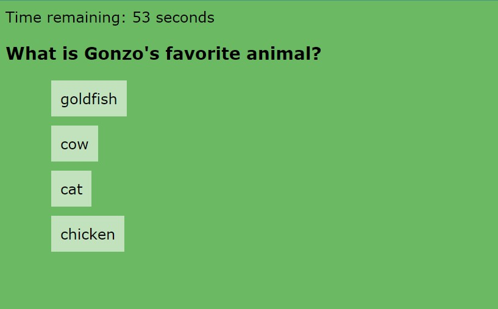

## Web API Quiz 

Name: Amy Kilgour

Please click [https://kilgette.github.io/web-apis-quiz/](https://kilgette.github.io/web-apis-quiz/) to view the live version.  

Objective: 
Build a multiple-choice question quiz that runs in the browser with dynamically updated HTML and CSS 
powered by JavaScript. 

What I Learned: 
I learned how to manipulate the DOM, more practice building functions, if statements, and constructing 
for loops as well as using local storage. This is a particular project I'd like to revisit and rework as my logical thinking 
and JavaScript skills grow. 

